# Автор: Федорчук Дмитрий Сергеевич DEVOPS-33

# Домашнее задание к занятию «Системы контроля версий»
## Задание 1. Создать и настроить репозиторий для дальнейшей работы на курсе

В рамках курса вы будете писать скрипты и создавать конфигурации для различных систем, которые необходимо сохранять для будущего использования. 
Сначала надо создать и настроить локальный репозиторий, после чего добавить удалённый репозиторий на GitHub.

### Создание репозитория и первого коммита

1. Зарегистрируйте аккаунт на [https://github.com/](https://github.com/). Если предпочитаете другое хранилище для репозитория, можно использовать его.
2. Создайте публичный репозиторий, который будете использовать дальше на протяжении всего курса, желательное с названием `devops-netology`.
   Обязательно поставьте галочку `Initialize this repository with a README`. 
   
    

    
3. Создайте [авторизационный токен](https://docs.github.com/en/authentication/keeping-your-account-and-data-secure/creating-a-personal-access-token) для клонирования репозитория.
4. Склонируйте репозиторий, используя протокол HTTPS (`git clone ...`).
 
    

    
5. Перейдите в каталог с клоном репозитория (`cd devops-netology`).
6. Произведите первоначальную настройку Git, указав своё настоящее имя, чтобы нам было проще общаться, и email (`git config --global user.name` и `git config --global user.email johndoe@example.com`). 
7. Выполните команду `git status` и запомните результат.
8. Отредактируйте файл `README.md` любым удобным способом, тем самым переведя файл в состояние `Modified`.
9. Ещё раз выполните `git status` и продолжайте проверять вывод этой команды после каждого следующего шага. 
10. Теперь посмотрите изменения в файле `README.md`, выполнив команды `git diff` и `git diff --staged`.
11. Переведите файл в состояние `staged` (или, как говорят, просто добавьте файл в коммит) командой `git add README.md`.
12. И ещё раз выполните команды `git diff` и `git diff --staged`. Поиграйте с изменениями и этими командами, чтобы чётко понять, что и когда они отображают. 
13. Теперь можно сделать коммит `git commit -m 'First commit'`.
14. И ещё раз посмотреть выводы команд `git status`, `git diff` и `git diff --staged`.

### Создание файлов `.gitignore` и второго коммита

1. Создайте файл `.gitignore` (обратите внимание на точку в начале файла), проверьте его статус сразу после создания. 
1. Добавьте файл `.gitignore` в следующий коммит (`git add...`).
1. На одном из следующих блоков вы будете изучать `Terraform`, давайте сразу создадим соотвествующий каталог `terraform` и внутри этого каталога — файл `.gitignore` по примеру: https://github.com/github/gitignore/blob/master/Terraform.gitignore.  
1. В файле `README.md` опишите своими словами, какие файлы будут проигнорированы в будущем благодаря добавленному `.gitignore`.
1. Закоммитьте все новые и изменённые файлы. Комментарий к коммиту должен быть `Added gitignore`.

### Эксперимент с удалением и перемещением файлов (третий и четвёртый коммит)

1. Создайте файлы `will_be_deleted.txt` (с текстом `will_be_deleted`) и `will_be_moved.txt` (с текстом `will_be_moved`) и закоммите их с комментарием `Prepare to delete and move`.
1. В случае необходимости обратитесь к [официальной документации](https://git-scm.com/book/ru/v2/Основы-Git-Запись-изменений-в-репозиторий) — здесь подробно описано, как выполнить следующие шаги. 
1. Удалите файл `will_be_deleted.txt` с диска и из репозитория. 
1. Переименуйте (переместите) файл `will_be_moved.txt` на диске и в репозитории, чтобы он стал называться `has_been_moved.txt`.
1. Закоммитьте результат работы с комментарием `Moved and deleted`.

### Проверка изменения

1. В результате предыдущих шагов в репозитории должно быть как минимум пять коммитов (если вы сделали ещё промежуточные — нет проблем):
    * `Initial Commit` — созданный GitHub при инициализации репозитория. 
    * `First commit` — созданный после изменения файла `README.md`.
    * `Added gitignore` — после добавления `.gitignore`.
    * `Prepare to delete and move` — после добавления двух временных файлов.
    * `Moved and deleted` — после удаления и перемещения временных файлов. 
2. Проверьте это, используя комманду `git log`. Подробно о формате вывода этой команды мы поговорим на следующем занятии, но посмотреть, что она отображает, можно уже сейчас.

### Отправка изменений в репозиторий

Выполните команду `git push`, если Git запросит логин и пароль — введите ваши логин и пароль от GitHub. 

В качестве результата отправьте ссылку на репозиторий. 

----
## Решение 1

1. Зарегистрировал аккаунт на https://github.com/. Ссылка на профиль: https://github.com/DemoniumBlack
2. Создал публичный репозиторий и созданием файла README.md. Ссылка на репозиторий: https://github.com/DemoniumBlack/devops-netology
3. Создал авторизационный токен для клонирования репозитория:

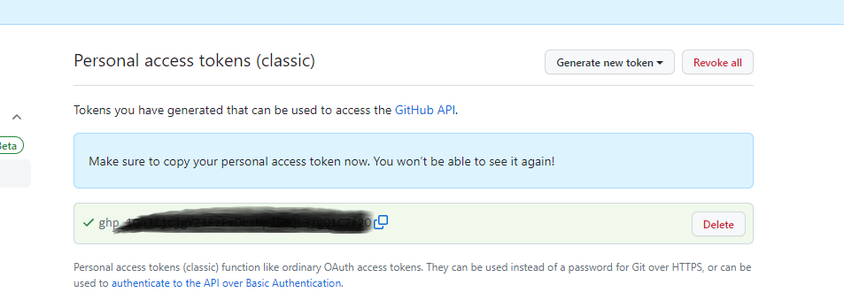

4. Склонировал созданный ранее репозиторий на свой компьютер используя ранее созданный авторизационный токен:
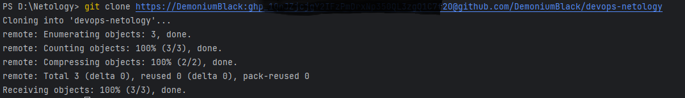

5. Перешел в папку с клоном репозитория:

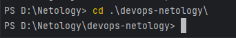

6. Произвел первоначальную настройку Git:
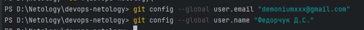

7. Выполнил команду git status:

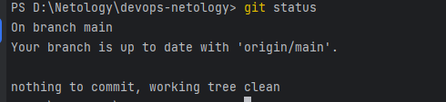

Вижу, что все данные обновлены, нахожусь в ветке "main", измененных файлов и коммитов еще не было.

8. Внес изменения в файл README.md

9. Выполняю еще раз git status, вижу, что произошли изменения в файле README.md. Предлагается внести изменения в индекс и закоммитить их.

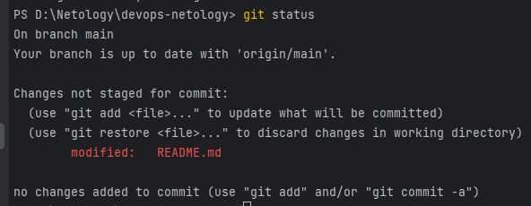

10. Проверяю внесенные изменение файле README.md, выполнив команды git diff и git diff --staged:

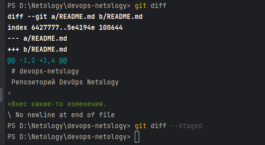

Команда git diff показывает разницу между тем, что было и что стало. git diff в ключом --staged отобразит только изменения в файлах в «подготовленной» к передаче в репозиторий области.
Поскольку добавления файлов в индекс и коммита изменений еще не было, git diff --staged выводит пустой результат.

11. Перевел файл в состояние staged командой  git add README.md. После этого проверяю статус и вижу, что изменения будут приняты коммитом:

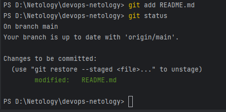

12. Снова проверяю изменения командой git diff и вижу пустой вывод, т.к. я больше не делал изменений в файле. Но вывод команды git diff --staged теперь выдает результат, т.к. я подготовил эти изменения к коммиту (git commit -m "comment") и пушу (git push) в репозитторий.

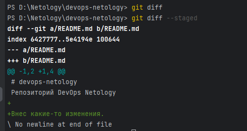

13. Теперь сделаю коммит:

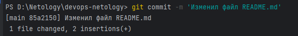

14. Снова проверю вывод команд git status, git diff и git diff --staged:

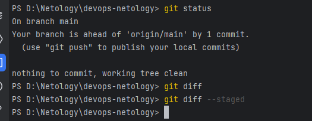

git status показал, что он готов запушить (git push) данные в репозиторий.
git diff не показал вывода, т.к. не было изменений в файлах.
git diff --staged не показал вывода, т.к. нет готовых к коммиту и пушу изменений.

### Создание файлов `.gitignore` и второго коммита

1. Создал файл .gitignore и проверил статус:

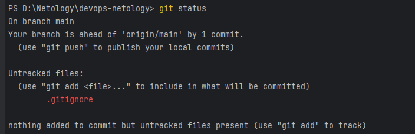

git status показал, что добавлен файл .gitignore, но еще не добавлен в индекс.

2. Добавил файл .gitignore в коммит:

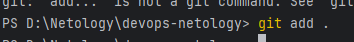

3. Создал каталог terraform и поместил внутри него файл terraform.gitignore из репозитория указанного в задании:

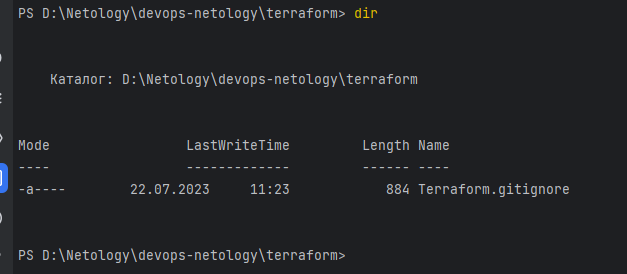

4. Добавил в README.md описание файлов, которые будут игнорированы с помощью файла terraform.gitignore

5. Закоммитил все изменения:

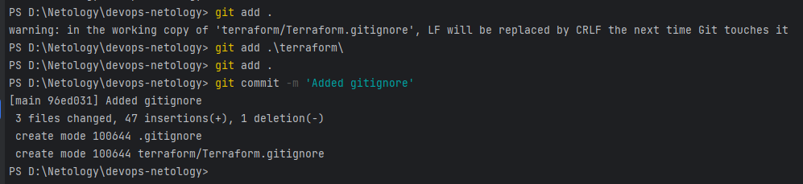

### Эксперимент с удалением и перемещением файлов (третий и четвёртый коммит)

1. Создал в папке 2 файла с текстом, закоммитил изменения:

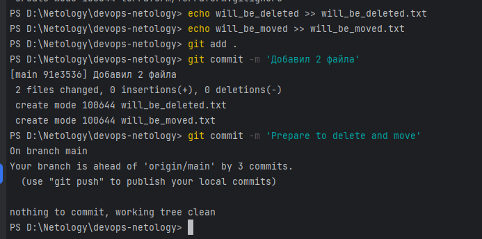

2. Почитал документацию.

3. Удалил файл с диска, проверил статус:

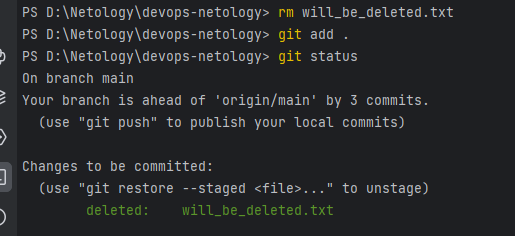

4. Переименовал файл will_be_moved.txt в has_been_moved.txt:

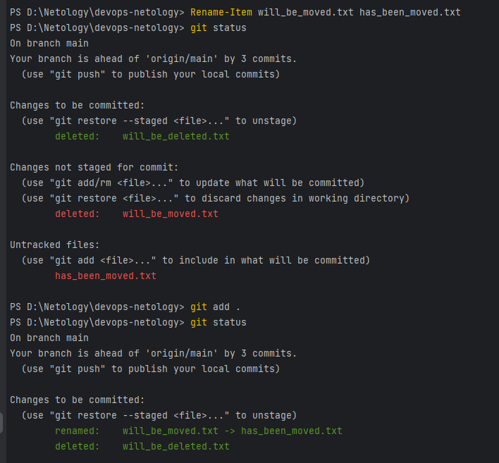

5. Закоммитил изменения:

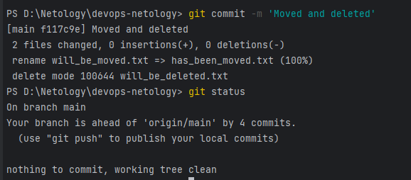

### Проверка изменения

1. Выполнял коммиты, но возможно, какой-то пропустил.

2. Смотрю с помощью git log коммиты и вижу, что они действительно есть:

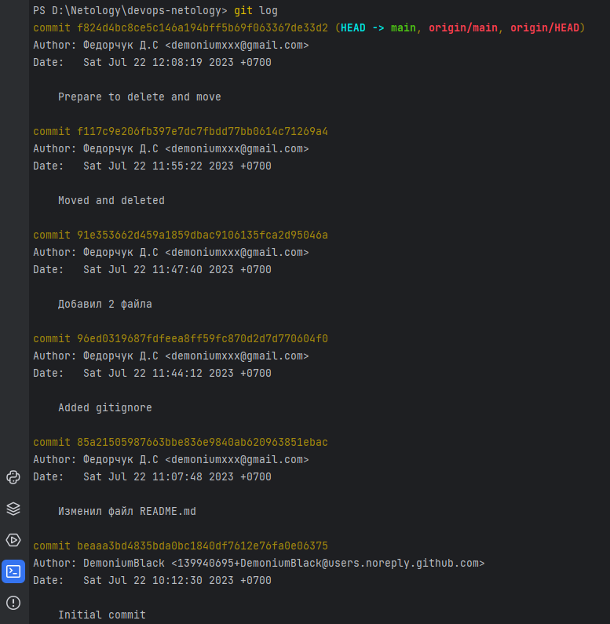

### Отправка изменений в репозиторий

Командой git push отправляю файлы в репозиторий:

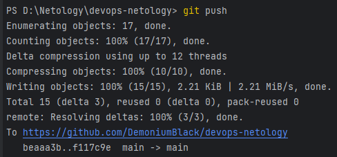

Ссылка на репозиторий: https://github.com/DemoniumBlack/devops-netology